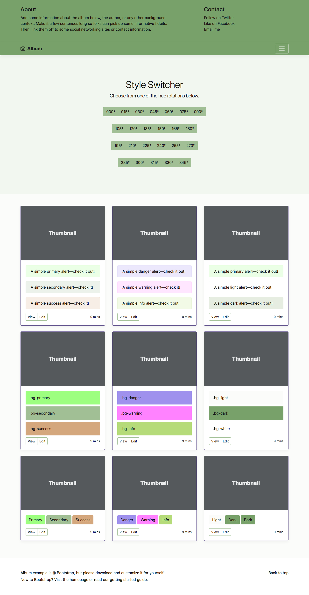
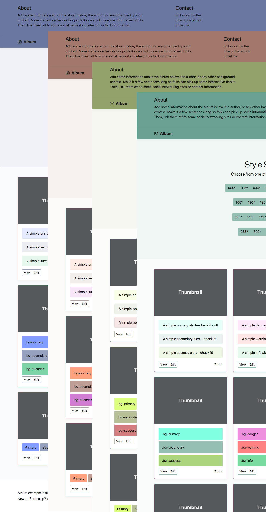

# csshue
CLI utility to uniformly rotate hue of colors in a css file.



## Constraints

Colors change everywhere, this may cause text readability issues, to address
this issue all text is darkened to an almost black color. Text should be dark,
in general. You can change that value or disable it altogether via the -t flag.



## Examples

```bash

npx csshue --input old.css --rotate 180 --output new.css
npx csshue --input https://stackpath.bootstrapcdn.com/bootstrap/4.1.1/css/bootstrap.min.css --rotate 140 --output pukestrap.min.css

```
Generate 0-345 variations.

```bash

#!/bin/bash
STEP=15;
for (( c=0; c<=$((360-$STEP)); c=$((c+$STEP)) ))
do
  npx csshue --input https://stackpath.bootstrapcdn.com/bootstrap/4.1.1/css/bootstrap.min.css --rotate $c --output pukestrap.`printf "%03.0f" $c`.min.css
done

```

Example only; use a local/cached copy of bootstrap.min.css please.

## Features

- input flag can be a file or url
- rotation can be more than 360, it will wrap around
- output can be STDOUT or filename
- Supports hue rotation only, serves as a template for other transformation utils.

## TLDR

```bash

npx csshue --input original.css --rotate 180 --output redesigned.css
```
Or grab a file from some CDN (Using a remote url)

```bash
npx csshue --input https://stackpath.bootstrapcdn.com/bootstrap/4.1.1/css/bootstrap.min.css --rotate 140 --output pukestrap.min.css

```
